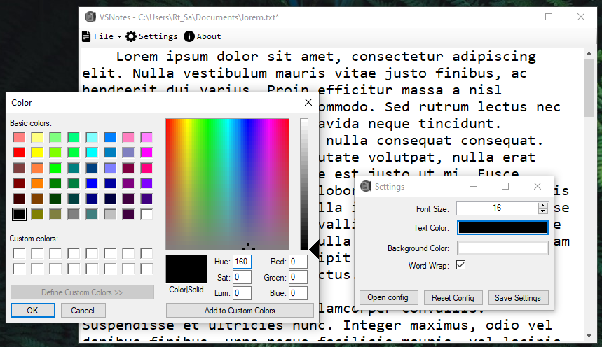

# VSNotes

    

    
Very Sophisticated Notes application made with C# .NET

 ## Features
  - [X] Menu Shortcuts
  - [X] Works with OS's undo/redo functionalities (i think)
  - [X] font size, text color and background color customization.
  - [X] enable / disable word wrap
  - [X] you can write things
  - [X] monospace font
  - [ ] change fonts
  - [ ] looking slick

## Screenshot

### Info
Default installation location: `C:\Program Files (x86)\VSNotes`  
Config file: `%appdata%/VSNotes`

## Special thanks to
chatgpt
